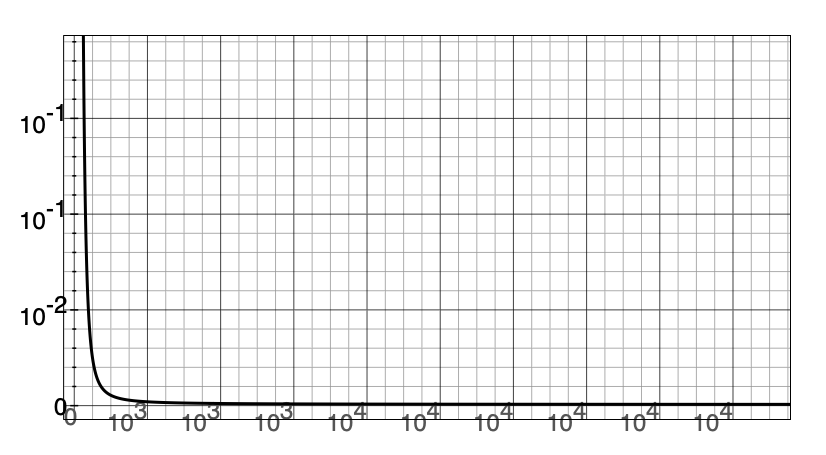
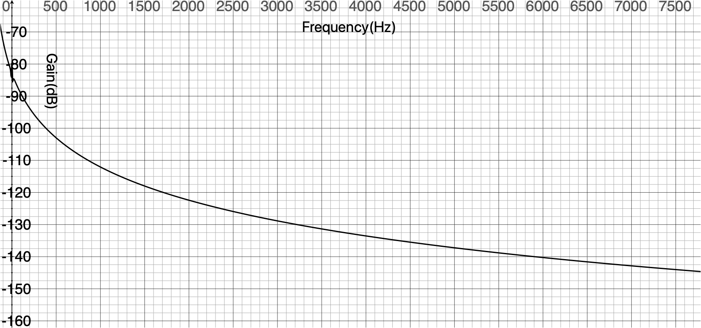
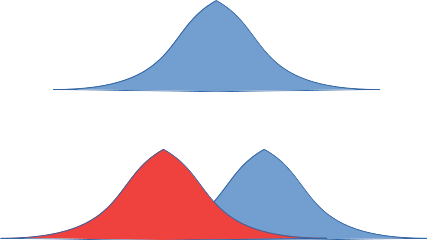
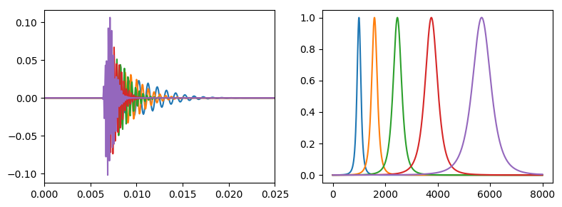

# Gammatone 滤波器的实现
  Gammatone滤波器冲击响应（Impulse response,IR）：

  $$
  g(t) = \frac{at^{n-1}\cos(2\pi f_ct+\phi)}{e^{2\pi b t}}
  $$

  其中:

  - $f_c$：中心频率
  - $b$ ：带宽，$1.019*ERB(f_c)$
  -
  当$ERB(f_c)=24.7*4.37/1000*f_c+24.7, f_c=1kHz, n=4$，IR如下
  

## 中心频率处的增益和相移

$g(t)$ 可分解为两部分的乘积，即
$$
g(t)=a \times r(t) \times s(t)
$$
其中
$$
\begin{align}
r(t)&=t^{n-1}e^{-2\pi bt}\\
s(t)&=cos(2\pi f_c t+\phi)
\end{align}
$$

时域相乘==频域卷积，即：
$$
G(f)=a\times R(f)*S(f)
$$

可以分别计算 $R(f)$ 和 $S(f)$ ，即：
$$
\begin{equation}
\begin{aligned}
R(f)=FT(t^{n-1}e^{-2\pi b t})
&=\frac{1}{(j2\pi)^{n-1}}\frac{\partial^{n-1} FT(e^{-2\pi bt})}{\partial f^{n-1}}\\
&=\frac{1}{(j2\pi)^{n-1}}\frac{\partial^{n-1}\frac{1}{2\pi b+j2\pi f}}{\partial f^{n-1}}\\
&=\frac{1}{(j2\pi)^{n-1}}\frac{(j)^{n-1}(n-1)!}{2\pi}\frac{1}{(b+jf)^n}\\
&=\frac{(n-1)!}{(2\pi b)^n}\frac{1}{(1+jf/b)^n}
\end{aligned}
\end{equation}
$$

$$
\begin{equation}
\begin{aligned}
S(f)=FT\left(cos(2\pi f_ct+\phi)\right)
&=e^{j\phi}\delta(f-f_c)+e^{-j\phi}\delta(f+f_c)
\end{aligned}
\end{equation}
$$
所以有
$$
\begin{equation}
\begin{aligned}
G(f)&=a \times R(f)*S(f)\\
&=a \times e^{j\phi}\frac{(n-1)!}{(2\pi b)^n}\frac{1}{(1+j(f-f_c)/b)^n}+ae^{-j\phi}\frac{(n-1)!}{(2\pi b)^n}\frac{1}{(1+j(f+f_c)/b)^n}\\
&=a\frac{(n-1)!}{(2\pi b)^n}\left[e^{j\phi}\left(\frac{1}{(1+j(f-f_c)/b)}\right)^n+e^{-j\phi}\left(\frac{1}{(1+j(f+f_c)/b)}\right)^n\right]
\end{aligned}
\end{equation}
$$
对于中心频率处，有
$$
\begin{equation}
\begin{aligned}
\left.G(f)\right|_{f=f_c}&=\left.a\frac{(n-1)!}{(2\pi b)^n}\left[e^{j\phi}\left(\frac{1}{(1+j(f-f_c)/b)}\right)^n+e^{-j\phi}\left(\frac{1}{(1+j(f+f_c)/b)}\right)^n\right]\right|_{f=f_c}\\
&=a\frac{(n-1)!}{(2\pi b)^n}\left[e^{j\phi}+e^{-j\phi}\frac{1}{(1+2jf_c/b)^n}\right]\\
&=a\frac{(n-1)!}{(2\pi b)^n}\left[e^{j\phi}+e^{-j\phi}\frac{1}{(1+2jQ)^n}\right]
\end{aligned}
\end{equation}
$$
通常 $cos(2\pi f_c t+\phi)$ 中的起始相位 $\phi$ 为0，即：
$$
\begin{equation}
\begin{aligned}
Gain(f=f_c)&=\frac{(n-1)!}{(2\pi b)^n }\left[1+\frac{1}{(1+j2Q)^n}\right]\\
&=\frac{6}{(2\pi b)^4}\left[1+\frac{1}{(1+j2f/b)^4}\right]\\
&=\frac{6}{(2\pi b)^4}\left[1+\frac{1}{(1-4Q^2+4jQ)^2}\right]\\
&=\frac{6}{(2\pi b)^4}\left[1+\frac{1}{1-8Q^2+16Q^4-16Q^2+2(1-4Q^2)4jQ}\right]\\
&=\frac{6}{(2\pi b)^4}\left[1+\frac{1}{16Q^4-24Q^2+1+8jQ(1-4Q^2)}\right]\\
&=\frac{6}{(2\pi b)^4}\left[\frac{16Q^4-24Q^2+2+8jQ(1-4Q^2)}{16Q^4-24Q^2+1+8jQ(1-4Q^2)}\right]\\
&=\frac{3}{(2\pi b)^4}\frac{r_1e^{\phi_1}}{r_2e^{\phi_2}}\\
\end{aligned}
\end{equation}
$$
其中
$$
\begin{equation}
\begin{aligned}
\begin{cases}
r_1 = \sqrt{(16Q^4-24Q^2+2)^2+(8Q-32Q^3)^2}\\
\phi_1 = \arctan{\frac{8Q-32Q^3}{16Q^4-24Q^2+2}}\\
r_2 = \sqrt{(16Q^4-24Q^2+1)^2+(8Q-32Q^3)^2}\\
\phi_2 = \arctan{\frac{8Q-32Q^3}{16Q^4-24Q^2+1}}
\end{cases}
\end{aligned}
\end{equation}
$$

$$
\begin{equation}
\begin{aligned}
Gain_{f_c} = \frac{3}{(2\pi b)^4}\frac{\sqrt{(16Q^4-24Q^2+2)^2+(8Q-32Q^3)^2}}{\sqrt{(16Q^4-24Q^2+1)^2+(8Q-32Q^3)^2}}\\
\phi_{f_c} = \arctan{\frac{8Q-32Q^3}{16Q^4-24Q^2+2}}-\arctan{\frac{8Q-32Q^3}{16Q^4-24Q^2+1}}\\
\end{aligned}
\end{equation}
$$

中心频率处的延时
[Delay grapher](grapher/gammatone_delay.gcx)

中心频率处的增益
[Gain grapher](grapher/gammatone_gain.gcx)

根据Glassberg and Moore给出的ERB的公式
$$
\begin{equation}
\begin{aligned}
Q=\frac{f_c}{b}=\frac{f_c}{24.7*4.37/1000*f_c+24.7}=\frac{1}{0.108+24.7/f_c}
\end{aligned}
\end{equation}
$$
随着中心频率的增大，Q越来越大，此时增益中 $\frac{1}{(1+2jQ)^n}$ 可以近似忽略，此时中心频率处：
$$
\begin{equation}
\begin{aligned}
\begin{cases}
G(f_c)=\frac{a(n-1)!}{(2\pi b)^n}\\
\phi(f_c) = 0
\end{cases}
\end{aligned}
\end{equation}
$$

## 历史由来

参考了Ma Ning的C语言实现，其doc中写到该算法是基于Cooke的工作。Lyon关于all pole gammatone filter的文档[^Lyon1996]总结了gammatone滤波器的历史，根据该文档，

- 1988年，Holdsworth利用frequency-shifting 滤波器，用all-pole IIR lowpass filter实现了Gammatone滤波器的近似
- 1991年，Darling对Holdsworth的方法进行简化
- 1991年，Cooke对Gammatone滤波器的各种近似实现进行对了详细的比较

## 实现方法

### IIR [^Darling]

符号未和参考文章统一
令
$$
\begin{equation}
\begin{aligned}
k&=a \times \frac{(n-1)!}{(2\pi b)^n}\\
P(f)&=k \times e^{j\phi}\left(\frac{1}{(1+j(f-f_c)/b)}\right)^n
\end{aligned}
\end{equation}
$$
则 $G(f)$ 可简写为
$$
G(f)=P(f)+P^*(-f)
$$
又因为$IFT(A^*(-f))=a^*(t)$，则
$$
g(t)=p(t)+p^*(t)=2\mathcal{R}(p(t))\\
y(t)=g(t)*x(t)=2\mathcal{R}\left(p(t)*x(t)\right)
$$
因此，只需要计算 $p(t)$ 即可。

接下来针对$P(f)$ 进行分析
$$
\begin{equation}
\begin{aligned}
P(f)&=e^{j\phi}\left(\frac{k^{1/n}}{(1+j(f-f_c)/b)}\right)^n\\
&=e^{j\phi}(\tilde{P}(f))^n
\end{aligned}
\end{equation}
$$
其中 $\tilde{P}(f)=\frac{\gamma}{1+j(f-f_c)/b},\gamma=k^{1/n}$

 这里可以看出，$P(f)$ 可以看作由 $n$ 个 $\tilde{P}(f)$ 级联而成，而每个 $\tilde{P}(f)$ 是简单的2阶IIR滤波器。

**实现 $A(f)$ 的两种方法：**

1. 将$P(f)$分解为n个级联的二阶IIR滤波器，计算 $\tilde{P}(f)$ 对应的数字滤波器
2. 直接计算$P(f)$对应的数字滤波器

#### 冲击响应不变
首先计算 ${P}(f)$ 对应的s变换：
$$
\begin{equation}
\begin{aligned}
P(f)&=e^{j\phi}k\left(\frac{2\pi b}{(2\pi b-j2\pi f_c)+j2\pi f}\right)^n\\
P(s)&=e^{j\phi}k(2\pi b)^n\left(\frac{1}{s-2\pi (jf_c-b)}\right)^n
=\frac{e^{j\phi}k(2\pi b)^n}{(-1)^{n-1}(n-1)!}\frac{\partial^{n-1}\frac{1}{s-2\pi(jf_c-b)}}{\partial s^{n-1}}
\end{aligned}
\end{equation}
$$
因为
$$
\frac{\partial^n F(s)}{\partial s^n}=(-1)^nt^nf(t)\\
\frac{1}{s-2\pi(jf_c-b)}=>e^{2\pi (jf_c-b)t}
$$
所以 $P(s)$ 的计算冲击响应 $a(t)$ 可计算为
$$
\begin{equation}
\begin{aligned}
p(t)=IST\left(P(s)\right)&=IST\left(\frac{e^{j\phi}k(2\pi b)^n}{(-1)^{n-1}(n-1)!}\frac{\partial^{n-1}\frac{1}{s-2\pi(jf_c-b)}}{\partial s^{n-1}}\right)\\
&=\frac{e^{j\phi}k(2\pi b)^n}{(-1)^{n-1}(n-1)!}(-1)^{n-1}t^{n-1}e^{2\pi (jf_c-b)t}\\
&=\frac{e^{j\phi}k(2\pi b)^n}{(n-1)!}t^{n-1}e^{2\pi (jf_c-b)t}\\
\end{aligned}
\end{equation}
$$
对其进行时域采样，采样间隔为 $T$
$$
p(i)=\frac{e^{j\phi}k(2\pi b)^n}{(n-1)!}(Ti)^{n-1}e^{2\pi (jf_c-b)Ti}\\
$$
如果设定中心频率处的增益为0，即 $P(f=f_c)=1$
$$
\Vert P(f=f_c)\Vert=\left\Vert e^{j\phi}k\left(\frac{2\pi b}{2\pi (b-jf_c)+j2\pi f_c}\right)^n\right\Vert =k\triangleq1
$$
所以
$$
\begin{equation}
\begin{aligned}
p(i)&=\frac{e^{j\phi}(2\pi bT)^n}{(n-1)!}i^{n-1}e^{2\pi (jf_c-b)Ti}\\
&=Gain\times e^{j\phi} i^{n-1}e^{2\pi (jf_c-b)Ti}
\end{aligned}
\end{equation}
$$
其中$Gain =\frac{(2\pi bT)^n}{(n-1)!}$

令$c=2\pi(jf_c-b)T$，则
$$
\begin{equation}
\begin{aligned}
p(i)=Gain\times e^{j\phi} i^{n-1}e^{ci}
\end{aligned}
\end{equation}
$$
又因为
$$
ie^{ci}=>z^{-1}\frac{\partial(\frac{1}{1-z^{-1}e^{c}})}{\partial z^{-1}}
$$
对于 $P(z)$ 来说，需要进行n-1次求导，没有找到直接计算的方法，这里进行逐次推导

令 $p_1(i)=Gain \times e^{j\phi}e^{ci}$

1. n=2, 1次求导
$$
\begin{equation}
\begin{aligned}
p_1(i)&=Gain*e^{j\phi}(i)e^{ci}\\
P_1(z)&=Gain*e^{j\phi}z^{-1}\left(\frac{e^{c}}{(1-z^{-1}e^{c})^2}\right)
\end{aligned}
\end{equation}
$$
2. n=3，2次求导
   $$
   \begin{equation}
   \begin{aligned}
   p_2(i)&=ip_1(i)\\
   P_2(z)&=z^{-1}\frac{P_1(z)}{\partial z^{-1}}=Gain*e^{j\phi}z^{-1}\left(\frac{e^{c}}{(1-z^{-1}e^{c})^2} + \frac{2e^{2c}z^{-1}}{(1-z^{-1}e^{c})^3} \right)
   \end{aligned}
   \end{equation}
   $$

3. 3次求导
    $$
    \begin{equation}
       \begin{aligned}
       p_3(i)&=ip_2(i)\\
       P_3(z)&=z^{-1}\frac{P_2(z)}{\partial z^{-1}}\\
       &=Gain*e^{j\phi}z^{-1}\left[\frac{e^{c}}{(1-z^{-1}e^{c})^2} + \frac{2e^{2c}z^{-1}}{(1-z^{-1}e^{c})^3} +z^{-1}\left(\frac{2e^{2c}}{(1-z^{-1}e^{c})^3}+\frac{2e^{2c}}{(1-z^{-1}e^{c})^3}+\frac{6e^{3c}z^{-1}}{(1-z^{-1}e^{c})^4}\right) \right]\\
       &=Gain*e^{j\phi}\left[\frac{z^{-1}e^{c}(1-z^{-1}e^{c})^2}{(1-z^{-1}e^{c})^2} + \frac{6e^{2c}z^{-2}}{(1-z^{-1}e^{c})^3} +\frac{6e^{3c}z^{-3}}{(1-z^{-1}e^{c})^4} \right]\\
       &=Gain*e^{j\phi}\left[\frac{z^{-1}e^{c}(1-2z^{-1}e^{c}+z^{-2}e^{2c})}{(1-z^{-1}e^{c})^4} + \frac{6e^{2c}z^{-2}-6e^{3c}z^{-3}}{(1-z^{-1}e^{c})^4} +\frac{6e^{3c}z^3}{(1-z^{-1}e^{c})^4} \right]\\   &=Gain*e^{j\phi}\left[\frac{e^{c}z^{-1}-2e^{2c}z^{-2}+e^{3c}z^{-3}+6e^{2c}z^{-2} -6e^{3c}z^{-3}+6e^{3c}z^{-3}}{(1-z^{-1}e^{c})^4}  \right]\\
       &=Gain*e^{j\phi}\left[\frac{e^{c}z^{-1}+4e^{2c}z^{-2}+e^{3c}z^{-3}}{(1-z^{-1}e^{c})^4}  \right]\\
       \end{aligned}
       \end{equation}
    $$

#### Base-band 冲击响应不变

$g(t)$ 可分解为两部分的乘积，即
$$
g(t)=a \times r(t) \times s(t)
$$
其中
$$
\begin{align}
r(t)&=t^{n-1}e^{-2\pi bt}\\
s(t)&=cos(2\pi f_c t+\phi)
\end{align}
$$

时域相乘==频域卷积，即：
$$
G(f)=a\times R(f)*S(f)
$$

可以分别计算 $R(f)$ 和 $S(f)$ ，即：
$$
\begin{equation}
\begin{aligned}
R(f)=FT(t^{n-1}e^{-2\pi b t})
&=\frac{1}{(j2\pi)^{n-1}}\frac{\partial^{n-1} FT(e^{-2\pi bt})}{\partial f^{n-1}}\\
&=\frac{1}{(j2\pi)^{n-1}}\frac{\partial^{n-1}\frac{1}{2\pi b+j2\pi f}}{\partial f^{n-1}}\\
&=\frac{1}{(j2\pi)^{n-1}}\frac{(j)^{n-1}(n-1)!}{2\pi}\frac{1}{(b+jf)^n}\\
&=\frac{(n-1)!}{(2\pi b)^n}\frac{1}{(1+jf/b)^n}
\end{aligned}
\end{equation}
$$

$$
\begin{equation}
\begin{aligned}
S(f)=FT\left(cos(2\pi f_ct+\phi)\right)
&=e^{j\phi}\delta(f-f_c)+e^{-j\phi}\delta(f+f_c)
\end{aligned}
\end{equation}
$$

$R(f)$ 是低通滤波器，由n个一阶低通滤波器及联得到；$S(f)$ 的功能则是频率搬移，将低通滤波器转换为带通滤波器。
在设计滤波器的时候，可以反过来，首先对输入信号降频 $f_c$ ，然后在应用低通滤波器 $R(f)$ ，问题就变的简单了。
1. 降频

  $$
  \begin{equation}
  \begin{aligned}
  x'(t)=IFT(X(f-f_c))&=IFT\left(\int{x(t)e^{-j2\pi(f-f_c)t}dt}\right)\\
  &=IFT\left(FT(e^{j2\pi f_c t}x(t))\right)\\
  &=e^{j2\pi f_c t}x(t)
  \end{aligned}
  \end{equation}
  $$
  这里其实只考虑了单边谱，因此计算增益的时候应该 $\times 2$

2. 低通滤波器的设计

    使用冲击响应不变法，对 $r(t)$ 进行采样，采样间隔为T，即：
    $$
    \begin{equation}
    \begin{aligned}
    r_d(i) = r(iT)= (iT)^{n-1}e^{-2\pi bTi}=T^{n-1}i^{n-1}e^{-2\pi bTi}\label{eq1}
    \end{aligned}
    \end{equation}
    $$
    令 $k=e^{-2\pi bT}$ ，上式就可以简化为
    $$
    \begin{equation}
    \begin{aligned}
    r_d(i)=T^{n-1}i^{n-1}k^{i}
    \end{aligned}
    \end{equation}
    $$

    因为
    $$
    \begin{equation}
    \begin{aligned}
    Z(if(i))&=\sum{if(i)z^{-i}}=-z\frac{\partial\sum{f(i)z^{-i}}}{\partial z}=z^{-1}\frac{\partial\sum{f(i)(z^{-1})^i}}{\partial z^{-1}}\\
    \end{aligned}
    \end{equation}
    $$

    $$
    \begin{equation}
    \begin{aligned}
    Z(k^{i})&=\frac{1}{1-kz^{-1}}
    \end{aligned}
    \end{equation}
    $$
    所以
    $$
    \begin{equation}
    \begin{aligned}
    Z(ik^i)&=z^{-1}\frac{\partial Z(k^{i})}{\partial z^{-1}}=z^{-1}\frac{\partial \frac{1}{1-kz^{-1}}}{\partial z^{-1}}=\frac{kz^{-1}}{(1-kz^{-1})^2}\\

    Z(i^2k^i)&=z^{-1}\frac{\partial Z(iz^{i})}{\partial z^{-1}}=z^{-1}\frac{\frac{kz^{-1}}{(1-kz^{-1})^2}}{\partial z^{-1}}=z^{-1}\left[\frac{k}{(1-kz^{-1})^2}+\frac{2k^2z^{-1}}{(1-kz^{-1})^3}\right]\\

    Z(i^3k^i)&=z^{-1}\frac{\partial Z(i^2k^{i})}{\partial z^{-1}}=z^{-1}\frac{z^{-1}\left[\frac{k}{(1-kz^{-1})^2}+\frac{2k^2z^{-1}}{(1-kz^{-1})^3}\right]}{\partial z^{-1}}\\
    &=z^{-1}\left[\frac{k}{(1-kz^{-1})^2}+\frac{2k^2z^{-1}}{(1-kz^{-1})^3}\right]+z^{-2}\left[\frac{2k^2}{(1-kz^{-1})^3}+\frac{2k^2}{(1-kz)^3}+\frac{6k^3z^{-1}}{(1-kz^{-1})^4}\right]\\
    &=\frac{z^{-1}k(1-kz^{-1})^2+2k^2z^{-2}(1-kz^{-1})+4k^2z^{-2}(1-kz^{-1})+6k^3z^3}{(1-kz^{-1})^4}\\
    &=\frac{kz^{-1}+k^3z^{-3}-2k^2z^{-2}+2k^2z^{-2}-2k^3z^{-3}+4k^2z^{-2}-4k^3z^{-3}+6k^3z^{-3}}{(1-kz^{-1})^4}\\
    &=\frac{k^3z^{-3}+4k^2z^{-2}+kz^{-1}}{(1-kz^{-1})^4}\\
    &=\frac{kz^{-1}(1+4kz^{-1}+k^2z^{-2})}{(1-2kz^{-1}+k^2z^{-2})^2}\\
    &=\frac{kz^{-1}(1+4kz^{-1}+k^2z^{-2})}{1-4kz^{-1}+2k^2z^{-2}+4k^2z^{-2}-4k^3z^{-3}+k^4z^{-4}}\\
    &=\frac{kz^{-1}(1+4kz^{-1}+k^2z^{-2})}{1-4kz^{-1}+6k^2z^{-2}-4k^3z^{-3}+k^4z^{-4}}\\
    \end{aligned}
    \end{equation}
    $$
    因此
    $$
    \begin{equation}
    \begin{aligned}
    Z(r_d(i)) &= Z\left(\frac{(n-1)!}{(2\pi b)^n}T^3*i^3k^i\right)=\frac{6T^3}{(2\pi b)^4}Z(i^3k^i)\\
    &=\frac{6T^3k}{(2\pi b)^4}\frac{z^{-1}(1+4kz^{-1}+k^2z^{-2})}{1-4kz^{-1}+6k^2z^{-2}-4k^3z^{-3}+k^4z^{-4}}\\
    \end{aligned}
    \end{equation}
    $$
    令 $c=\frac{6T^3k}{(2\pi b)^4}$ ,则上式子可重写为
    $$
    \begin{equation}
    \begin{aligned}
    Z(r_d(i))&=c\frac{z^{-1}(1+4kz^{-1}+k^2z^{-2})}{1-4kz^{-1}+6k^2z^{-2}-4k^3z^{-3}+k^4z^{-4}}\\
    \end{aligned}
    \end{equation}
    $$
    最终得到Gammatone滤波器的公式
    $$
    \begin{equation}
    y(n)=c\left[\underbrace{x(n-1)+4kx(n-2)+k^2x(n-3)}_\text{x part}+\underbrace{4ky(n-1)-6k^2y(n-2)+4k^3y(n-3)-k^4y(n-4)}_\text{y part}\right]
    \begin{aligned}
    \end{aligned}
    \end{equation}
    $$

  3. 滤波结果升频
  $$
  \begin{equation}
  \begin{aligned}
  y'(t)=Real\left(IFT(Y(f+f_c))\right)&=Real\left(IFT\left(\int{y(t)e^{-j2\pi(f+f_c)t}dt}\right)\right)\\
  &=Real\left(IFT\left(FT(e^{-j2\pi f_c t}y(t))\right)\right)\\
  &=Real\left(e^{-j2\pi f_c t}y(t)\right)
  \end{aligned}
  \end{equation}
  $$
  升频后信号的实部即为最终结果。

  ## 滤波器中心频率增益归一
  因为实现过程中将带通滤波器转换为低通滤波器，因此只需要对低通滤波器0频处的增益归一为1/2即可。
  因此，归一化系数应该是
  $$
  \begin{equation}
  \begin{aligned}
  scale &= \frac{1}{Z(r_d(i)|_{z=1})/2}=\frac{1}{c\frac{z^{-1}(1+4kz^{-1}+k^2z^{-2})}{1-4kz^{-1}+6k^2z^{-2}-4k^3z^{-3}+k^4z^{-4}}|_{z=1}/2}\\
  &= \frac{(1-k)^4}{c*(1+4k+k^2)}
  \end{aligned}
  \end{equation}
  $$

  ### 误差
  低通滤波器经移频之后，左右两部分可能存在overlap，从而使得带通滤波器中心频率处的增益略大于低通滤波器0频处的增益。误差系数为
  $$
  \begin{equation}
  \begin{aligned}
  \frac{\sqrt{(16Q^4-24Q^2+2)^2+(8Q-32Q^3)^2}}{\sqrt{(16Q^4-24Q^2+1)^2+(8Q-32Q^3)^2}} \approx 1
  \end{aligned}
  \end{equation}
  $$
  

  归一化后滤波器的冲击响应以及幅频响应如下图所示：
  

[^Darling]: Properties and Implementation of the GammaTone Filter: A Tutorial

[^Lyon1996]: The All-Pole Gammatone Filter and Auditory Models
