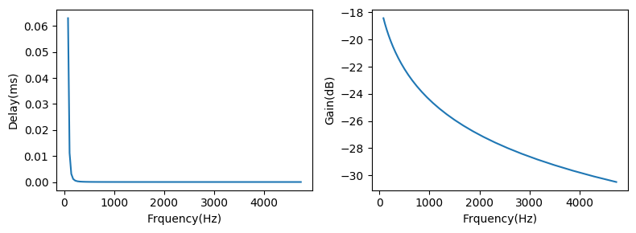
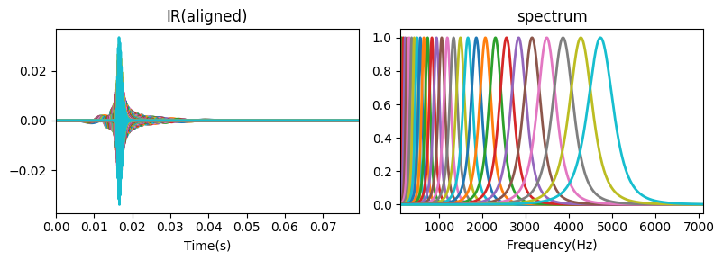
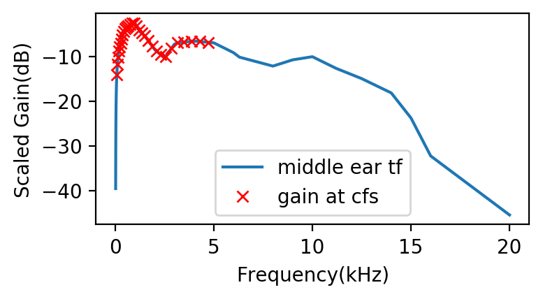
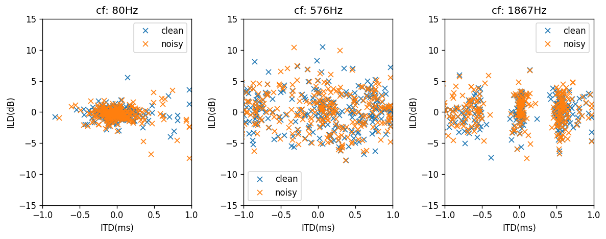
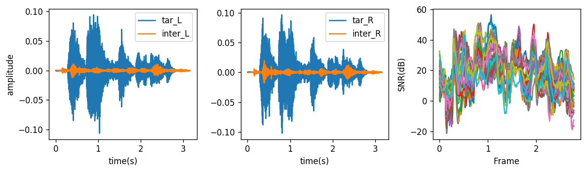

# Auditory model

A pytho class for auditory modelling

**Features**
- Gammatone filter

  A all-pole Gammatone filter bank is written in C and wrapped in python class
  if `Exception: missing libAPGF.so`, just recompile the C file
  ```shell
  g++ -fPIC -shared APGTF.c -o libAPGTF.so
  ```
- Middle ear transfer functin

  The middle ear transfer function is specified as gains in 39 frquencies ranging from 20 to 20,000 Hz. Data comes from ISO 532-2:2017
- Hair cell model

  Different models used in previous work
  - Lindemann: half-wave rectify + low-pass filter(1th Butterworth,cutoff-frequency 800Hz)
  - Breebart: half-wave rectify + low-pass filter(5th, cutoff-frequency 770Hz)
  - Roman: half-wave rectify + sqrt compress
- Spatial cues calculation

  Calcuate normalized cross-correlation function(CCF) and estimate ITD, ILD in each frequency band

  To speed up, cues calculatation of each band can be complete parallel, which is a default choice in function `Cal_cues`.
  what's more, to avoid runing out of memory, a limitaion 'overal memory usage < 60%'.

## Example
- Initiate Auditory_Model object

  ```python
  model = Auditor_Model.Auditor_Model(fs=16000,low_cf=80,high_freq=5000,N_band=30,)
  ```
- Gammatone filter impulse response

  ```python
  ir = model.plot_gtf()
  ```
  - delay and gains at center frequency of original Gammatone filter

    

  - Impulse response (gain normalzied)

    


  - Impulse response (gain normalized, phase compensation)

    


  - Middle ear transfer function

    ```python
    model.Cal_middle_ear_gain(is_plot=True)
    ```
    

- Calculate binaural cues

  ```python
  tar,fs = sf.read('tar.wav')
  inter,fs = sf.read('inter.wav')

  frame_len=20e-3

  cues_clean,ccfs_clean = model.Cal_cues(tar,frame_len=20e-3,max_delay=1e-3)
  cues_noisy,ccfs_noisy,snrs = model.Cal_cues(tar,inter=inter,frame_len=20e-3,max_delay=1e-3)

  fig = plt.figure(figsize=[10,4],dpi=120)
  axs = fig.subplots(1,3)
  for band_i in range(0,30,10):
      ax = axs[np.int(band_i/10)]
      ax.plot(cues_clean[band_i,:,0],cues_clean[band_i,:,1],'x',label='clean')
      ax.plot(cues_noisy[band_i,:,0],cues_noisy[band_i,:,1],'x',label='noisy')
      ax.set_xlim([-1,1]); ax.set_ylim([-15,15])
      ax.legend()
      ax.set_title('cf: {:.0f}Hz'.format(model.cfs[band_i]))
      ax.set_xlabel('ITD(ms)')
      ax.set_ylabel('ILD(dB)')
  plt.tight_layout()

  fig = plt.figure(figsize=[10,3],dpi=120)
  axs = fig.subplots(1,3)

  axs[0].plot(np.arange(tar.shape[0])/fs,tar[:,0],label='tar_L');
  axs[0].plot(np.arange(inter.shape[0])/fs,inter[:,0],label='inter_L');
  axs[0].set_xlabel('time(s)'); axs[0].set_ylabel('amplitude')
  axs[0].legend()


  axs[1].plot(np.arange(tar.shape[0])/fs,tar[:,1],label='tar_R');
  axs[1].plot(np.arange(inter.shape[0])/fs,inter[:,1],label='inter_R');
  axs[1].set_xlabel('time(s)'); axs[0].set_ylabel('amplitude')
  axs[1].legend()

  axs[2].plot(np.arange(snrs.shape[1])*frame_len/2,snrs.T)
  axs[2].set_xlabel('Frame'); axs[2].set_ylabel('SNR(dB)')

  plt.tight_layout()
  ```
  - Spatial cues
  

  - Instant SNRs
  

## Parallel efficy

```Python
  start_time = time.time()
  cues_clean,ccfs_clean = model.Cal_cues(tar,frame_len=20e-3,max_delay=1e-3,is_parallel=True)
  exc_time1 = time.time()-start_time

  start_time = time.time()
  cues_clean,ccfs_clean = model.Cal_cues(tar,frame_len=20e-3,max_delay=1e-3,is_parallel=False)
  exc_time2 = time.time()-start_time

  print('excute time: \n\t parallel: {:.2f} s \n\t normal: {:.2f} s'.format(exc_time1,exc_time2))
```
output
```
excute time:
	 parallel: 3.21 s
	 normal: 12.63 s
```

## Dependencies
[Soundfile](https://pypi.org/project/SoundFile/), which can be directly installed via pip
